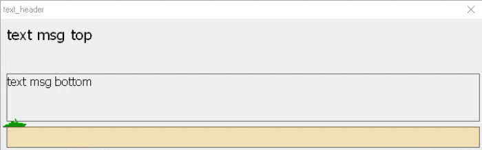

# Класс VBA Progress Bar

Класс VBA для отображения настраиваемой полосы прогресса во время длительных операций в Excel или других приложениях Office.



## Обзор

Класс `clsProgresBar` предоставляет простой в использовании интерфейс для отображения прогресса во время длительных операций. Он имеет чистый, настраиваемый интерфейс с поддержкой двойных сообщений, визуальных индикаторов и отмены пользователем.

## Возможности

- **Двойное отображение сообщений**: Верхняя и нижняя области сообщений для детальной информации о прогрессе
- **Визуальный индикатор прогресса**: Анимированная линия прогресса с настраиваемыми цветами
- **Отмена пользователем**: Поддержка отмены операций клавишей Esc
- **Настраиваемый внешний вид**: Настраиваемые символы, цвета и размеры
- **Оптимизированная производительность**: Эффективные обновления для минимизации задержек интерфейса
- **Обработка ошибок**: Комплексное управление ошибками и отчеты
- **Отслеживание времени**: Встроенный таймер для отслеживания продолжительности операции
- **Возможности логирования**: Автоматическое логирование событий прогресса

## Установка

1. Импортируйте модуль класса `clsProgresBar.cls` в ваш проект VBA
2. Импортируйте модуль формы `frmProgresBar_2.frm` в ваш проект VBA
3. Используйте класс в вашем коде, как показано в примерах использования

## Использование

### Базовое использование

```vba
Sub ExampleUsage()
    Dim oProg As clsProgresBar
    Set oProg = New clsProgresBar
    
    ' Инициализировать полосу прогресса
    oProg.Initialize "Обработка данных...", "Обработка данных", "Инициализация...", _
                     enumTypeCaptionLabel.enProcent, 100
    
    ' Симуляция длительной операции
    Dim i As Long
    For i = 1 To 100
        ' Обновить полосу прогресса
        oProg.Update i / 10, "Обработка элемента " & i
    Next i
    
    Set oProg = Nothing
End Sub
```

### Расширенное использование

```vba
Sub AdvancedExample()
    Dim oProg As clsProgresBar
    Set oProg = New clsProgresBar
    
    ' Инициализировать с настраиваемыми параметрами
    oProg.Initialize "Загрузка файлов...", "Загрузчик файлов", "Запуск...", _
                     enumTypeCaptionLabel.enAll, 500, RGB(0, 128, 255), RGB(20, 200, 200), "|", True, "*"
    
    ' Изменить размер полосы прогресса
    oProg.Resize 600, 40, 30, 20
    
    ' Обработка с обновлениями прогресса
    Dim i As Long
    For i = 1 To 500
        If oProg.Update(i / 500, "Файл " & i & " из 500") Then
            ' Пользователь запросил отмену
            Exit For
        End If
        
        ' Добавить задержку для симуляции работы
        Application.Wait Now + TimeValue("0:00:01")
    Next i
    
    ' Доступ к данным лога при необходимости
    Dim logData As Variant
    logData = oProg.LogData
    
    Set oProg = Nothing
End Sub
```

## Справочник API

### Перечисления

#### `enumTypeCaptionLabel`
Определяет тип информации, отображаемой на полосе прогресса:
- `enNone`: Никакой информации не отображается
- `enProcent`: Только проценты
- `enValue`: Текущее/Общее количество
- `enTime`: Прошедшее время
- `enProcentValue`: Проценты и значения
- `enProcentTime`: Проценты и прошедшее время
- `enValuTime`: Значения и прошедшее время
- `enAll`: Все типы информации

#### `enumParametrVersion`
Предоставляет доступ к информации о версии:
- `enName`: Имя класса
- `enAuthor`: Имя автора
- `enVersion`: Строка версии
- `enLicense`: Информация о лицензии
- `enDateOfCreation`: Дата создания
- `enDateOfUpdate`: Дата последнего обновления
- `enDescription`: Описательный текст
- `enAll`: Вся информация о версии

### Методы

#### `Initialize(sHeaderCaption As String, sMessageTop As String, sMessageBottom As String, TypeCaptionLabel As enumTypeCaptionLabel, Optional CountItems As Long = 0, Optional LineFrontColor As XlRgbColor = -1, Optional LineBackColor As XlRgbColor = -1, Optional sLineFrontSimvol As String = "|", Optional bPictureShow As Boolean = False, Optional sPictureSimvol As String = vbNullString)`
Инициализирует полосу прогресса с указанными параметрами.

- `sHeaderCaption`: Текст для заголовка формы
- `sMessageTop`: Сообщение для отображения в верхней области сообщений
- `sMessageBottom`: Сообщение для отображения в нижней области сообщений
- `TypeCaptionLabel`: Тип отображаемой информации
- `CountItems`: Общее количество элементов для расчета прогресса
- `LineFrontColor`: Цвет передней линии прогресса
- `LineBackColor`: Цвет фоновой линии прогресса
- `sLineFrontSimvol`: Символ для использования в линии прогресса
- `bPictureShow`: Показывать ли символ индикатора прогресса
- `sPictureSimvol`: Символ для отображения в позиции прогресса

#### `Update(procent As Single, sMessageBottom As String, Optional CountItems As Long = 0, Optional LineFrontColor As XlRgbColor = -1, Optional LineBackColor As XlRgbColor = -1) As Boolean`
Обновляет полосу прогресса новыми значениями и возвращает True, если пользователь запросил отмену.

- `procent`: Процент прогресса (0.0 до 1.0)
- `sMessageBottom`: Сообщение для отображения в нижней области сообщений
- `CountItems`: Общее количество элементов (необязательно)
- `LineFrontColor`: Новый цвет передней линии прогресса (необязательно)
- `LineBackColor`: Новый цвет фоновой линии прогресса (необязательно)

#### `Resize(WidthForm As Single, HeightMessageTop As Single, HeightMessageBottom As Single, HeightLineProgres As Single)`
Изменяет размер полосы прогресса.

- `WidthForm`: Ширина формы
- `HeightMessageTop`: Высота верхнего сообщения
- `HeightMessageBottom`: Высота нижнего сообщения
- `HeightLineProgres`: Высота линии прогресса

### Свойства

#### `HeaderCaption As String`
Получает или устанавливает текст заголовка формы.

#### `MessageTop As String`
Получает или устанавливает текст верхнего сообщения.

#### `MessageBottom As String`
Получает или устанавливает текст нижнего сообщения.

#### `PictureShow As Boolean`
Получает или устанавливает видимость символа индикатора прогресса.

#### `PictureSimvol As String`
Получает или устанавливает текст символа индикатора прогресса.

#### `PictureColor As XlRgbColor`
Получает или устанавливает цвет символа индикатора прогресса.

#### `LineFrontColor As XlRgbColor`
Получает или устанавливает цвет линии прогресса.

#### `LineBackColor As XlRgbColor`
Получает или устанавливает цвет фона линии прогресса.

#### `TimeWork As Date`
Получает прошедшее время с момента инициализации.

#### `TypeCaptionLabel As enumTypeCaptionLabel`
Получает или устанавливает тип метки заголовка.

#### `LogData As Variant`
Получает массив данных лога, содержащий события прогресса.

## Обработка ошибок

Класс корректно обрабатывает потенциальные ошибки:
- Недопустимые значения процентов нормализуются до диапазона 0-1
- Предотвращается деление на ноль в вычислениях
- Правильная очистка происходит в событии Class_Terminate

## Настройка

Полосу прогресса можно настроить несколькими способами:

- Цвета для линии прогресса и символа индикатора
- Размеры и габариты
- Видимость символа индикатора
- Текст заголовка и сообщений
- Символ индикатора прогресса
- Тип отображаемой информации (проценты, значения, время и т.д.)

## Производительность

Реализация оптимизирована для производительности за счет:

- Эффективных обновлений интерфейса
- Правильного управления памятью
- Минимизации дорогих операций во время обновлений
- Использования DoEvents для поддержания отзывчивости интерфейса

## Лицензия

Apache License 2.0